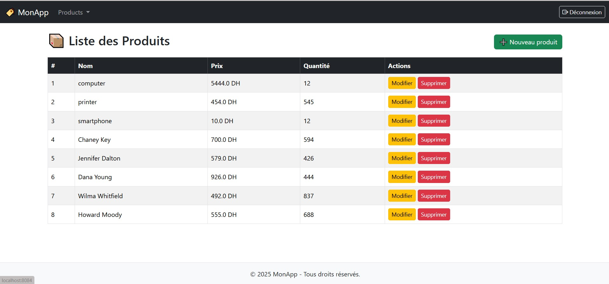

# 🏷️ Spring Product Manager

Une application web de gestion de produits développée avec Spring Boot, Spring MVC, Spring Security, Thymeleaf, Bootstrap et JPA (H2/MySQL).

---

## 📸 Aperçu



---

## ✅ Fonctionnalités

- ✅ Affichage de la liste des produits
- ✅ Ajout, modification, suppression de produits
- ✅ Formulaire de saisie avec validations
- ✅ Authentification sécurisée avec Spring Security
- ✅ Layout responsive avec navbar, footer, fragments Thymeleaf
- ✅ Déconnexion avec icône
- ✅ Intégration de Bootstrap Icons
- ✅ Responsive sur mobile avec menu hamburger

---

## 🛠️ Technologies utilisées

| Couche      | Technologies                                  |
|-------------|-----------------------------------------------|
| Backend     | Spring Boot, Spring MVC, Spring Data JPA      |
| Frontend    | Thymeleaf, Bootstrap 5, Bootstrap Icons       |
| Sécurité    | Spring Security                               |
| Base de données | H2 (dev) / MySQL (prod)                  |
| Autres      | Thymeleaf Layout Dialect                      |

---

## 🚀 Démarrer le projet

1. Cloner le repo :
```bash
git clone https://github.com/LAMBARAA-Abdellah/springboot-thymeleaf-security
cd spring-product-manager
