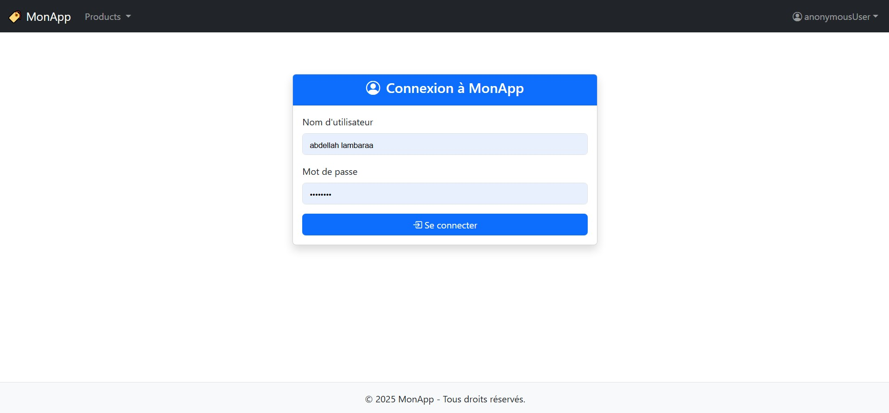
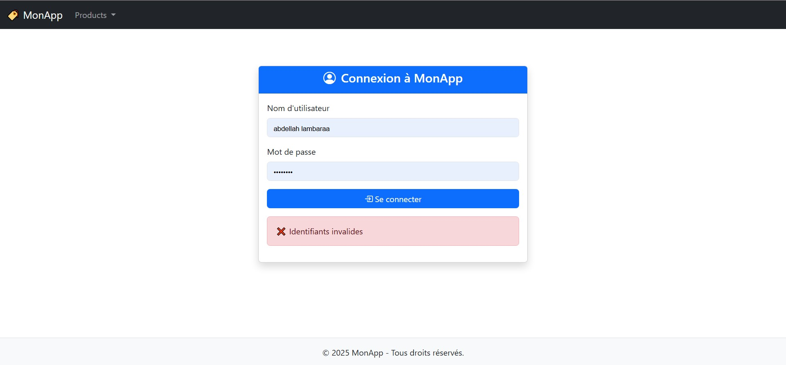
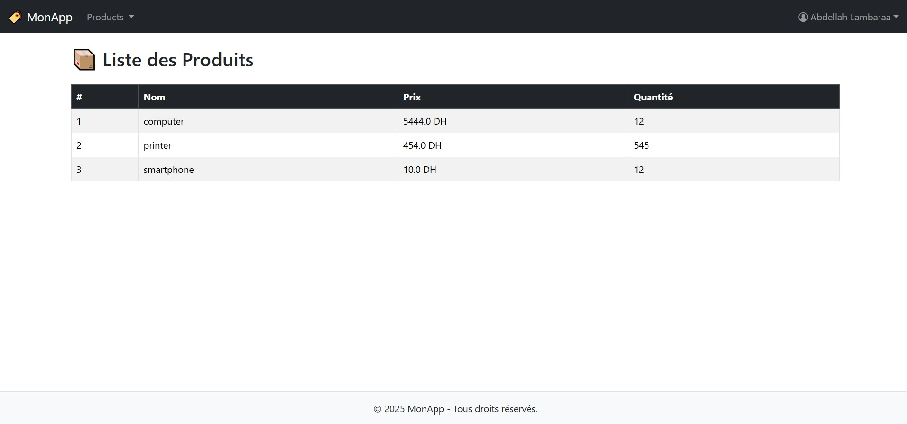
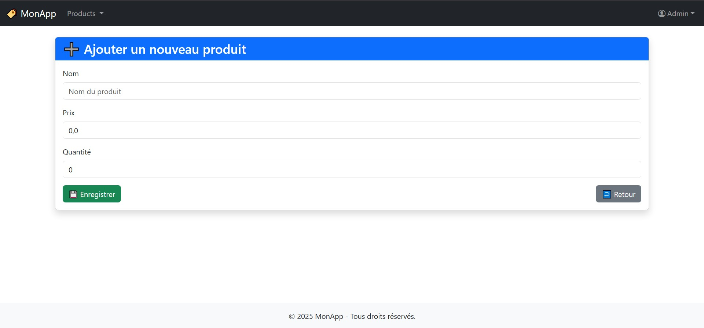
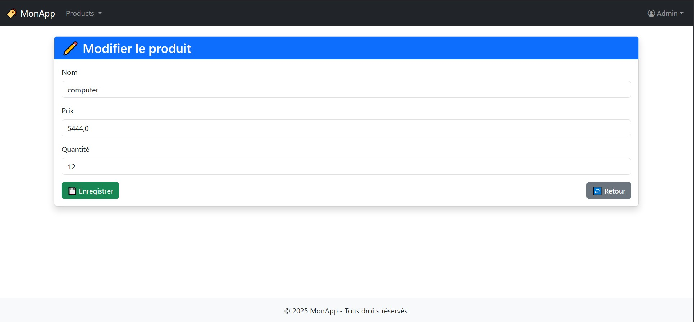
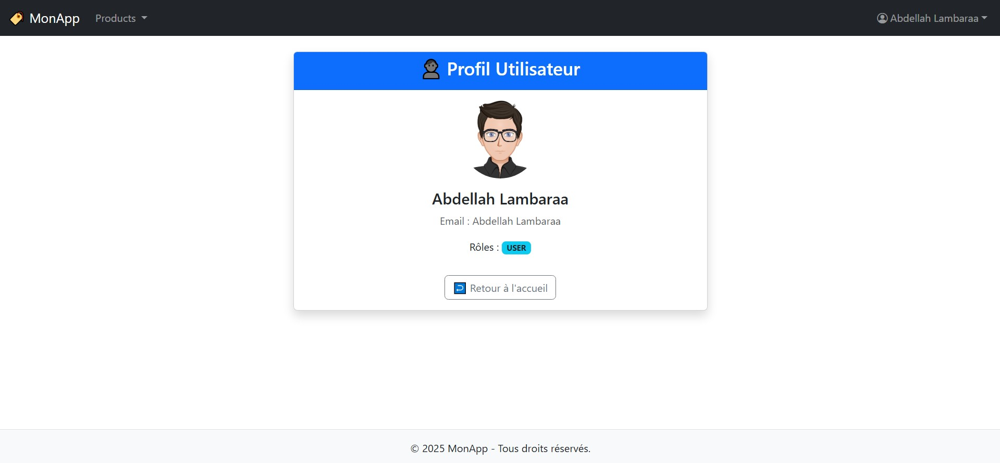
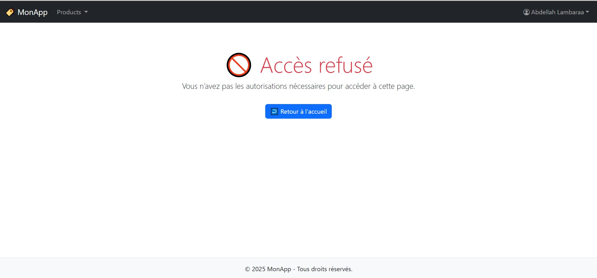

# 🏷️ Spring Product Manager

Une application web de gestion de produits développée avec Spring Boot, Spring MVC, Spring Security, Thymeleaf, Bootstrap et JPA (H2/MySQL).

---

## ✅ Fonctionnalités

- 🔒 Authentification avec Spring Security
- 👥 Gestion de rôles : **ADMIN** et **USER**
- 📋 Liste des produits
- ➕ Ajout, ✏️ modification, 🗑️ suppression (ADMIN uniquement)
- 👤 Vue profil utilisateur connecté
- 🔐 Page de login personnalisée
- ❌ Page d’accès refusé personnalisée (`403`)
- 🧱 Layout responsive avec navbar, footer, fragments Thymeleaf
- 📱 Design responsive avec menu mobile
- 🎨 Bootstrap + Bootstrap Icons

---
## 📸 Aperçu

### 🔐 Page de connexion personnalisée


### ❌ Identifiants invalides


### ✅ Vue ADMIN – Liste complète + gestion


### 👤 Vue USER – Liste lecture seule


### ➕ Ajouter un produit (ADMIN)


### ✏️ Modifier un produit


### 👤 Profil de l'utilisateur connecté


### 🚫 Accès refusé (403)


---


## 🛠️ Stack technique

| Couche      | Technologies                                  |
|-------------|-----------------------------------------------|
| Backend     | Spring Boot, Spring MVC, Spring Data JPA      |
| Frontend    | Thymeleaf, Bootstrap 5, Bootstrap Icons       |
| Sécurité    | Spring Security                               |
| Base de données | H2 (dev) / MySQL (prod)                  |
| Layout      | Thymeleaf Layout Dialect                      |

---

## 🚀 Démarrer le projet

### 1. Cloner le projet

```bash
git clone https://github.com/LAMBARAA-Abdellah/springboot-thymeleaf-security.git
cd springboot-thymeleaf-security